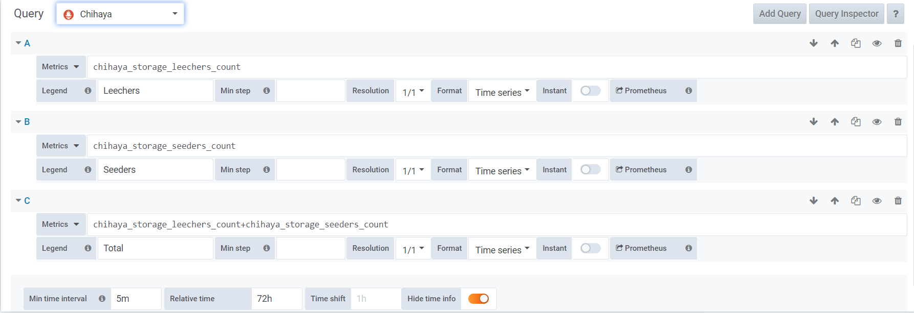
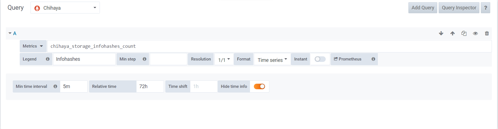
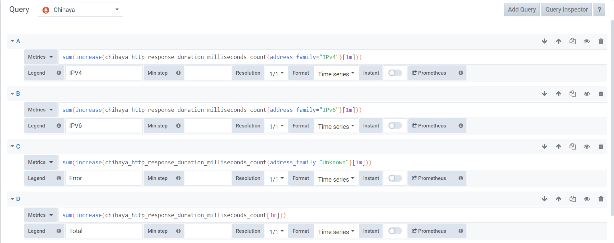
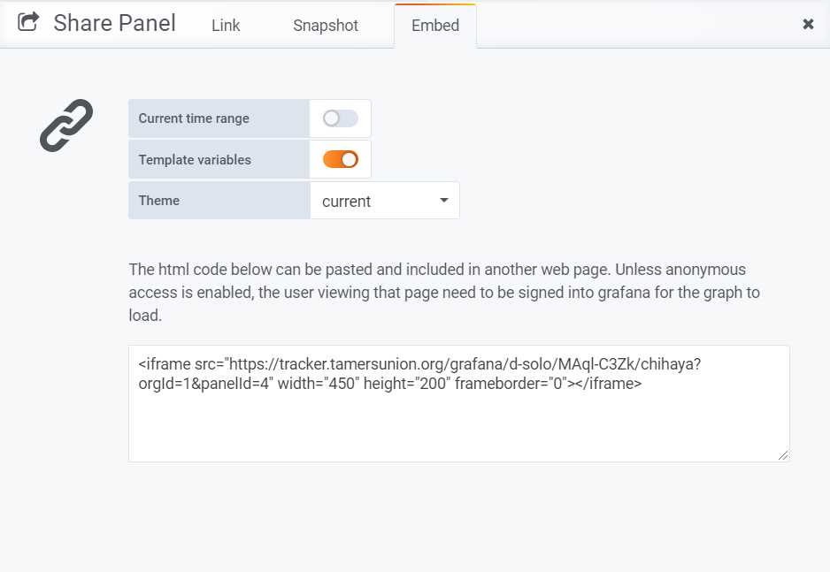

## Tamers Union Bittorrent Tracker
This tracker use [Chiahya](https://github.com/chihaya/chihaya) Project, the Binary file is builded at April, 2020.

### Chihaya
/chihaya includes Chihaya binary file, Chihaya config file and systemd file.

You can use a soft link to connect to the specified directory, or move file directly

Example
```
$ sudo chmod +x /www/tracker/chiahya/chihaya
$ sudo ln -s /www/tracker/chiahya/chihaya /usr/bin/chihaya
$ sudo mkdir /etc/chihaya
$ sudo ln -s /www/tracker/chihaya/chihaya.yaml /etc/chihaya/chihaya.yaml
$ sudo ln -s /www/tracker/chihaya/chihaya.service /lib/systemd/system/chihaya.service
$ chihaya --help

A customizable, multi-protocol BitTorrent Tracker

Usage:
  chihaya [flags]
  chihaya [command]

Available Commands:
  e2e         exec e2e tests
  help        Help about any command

Flags:
      --config string       location of configuration file (default "/etc/chihaya.yaml")
      --cpuprofile string   location to save a CPU profile
      --debug               enable debug logging
  -h, --help                help for chihaya
      --json                enable json logging
      --nocolors            disable log coloring
      --trace string        location to save a trace

Use "chihaya [command] --help" for more information about a command.

$ sudo systemctl enable chiahya
$ sudo systemctl start chihaya
```

### Prometheus
1. [Install Prometheus](https://prometheus.io/docs/prometheus/latest/getting_started/)
(It is recommended to install in /usr/local/prometheus)

2. Edit prometheus config (prometheus.yml)

Example
```
$ sudo vim /usr/local/prometheus.yml

# my global config
global:
  scrape_interval:     15s # Set the scrape interval to every 15 seconds. Default is every 1 minute.
  evaluation_interval: 15s # Evaluate rules every 15 seconds. The default is every 1 minute.
  # scrape_timeout is set to the global default (10s).

# Alertmanager configuration
alerting:
  alertmanagers:
  - static_configs:
    - targets:
      # - alertmanager:9093

# Load rules once and periodically evaluate them according to the global 'evaluation_interval'.
rule_files:
  # - "first_rules.yml"
  # - "second_rules.yml"

# A scrape configuration containing exactly one endpoint to scrape:
# Here it's Prometheus itself.
scrape_configs:
  # The job name is added as a label `job=<job_name>` to any timeseries scraped from this config.
  - job_name: 'chihaya'
    metrics_path: /
    scheme: http
    # metrics_path defaults to '/metrics'
    # scheme defaults to 'http'.
    static_configs:
      - targets: ['localhost:6880']
```
3. Add systemd config


Example
```
$ sudo vim /lib/systemd/system/prometheus.service

[Unit]
Description=Prometheus
Wants=network-online.target
After=network-online.target

[Service]
User=root
Group=root
Type=simple
ExecStart=/usr/local/prometheus/prometheus --config.file=/usr/local/prometheus/prometheus.yml --web.external-url=prometheus

[Install]
WantedBy=multi-user.target
```
4. Enable and start prometheus server
```
$ sudo systemctl enable prometheus
$ sudo systemctl start prometheus
```
5. Check prometheus status
```
$ sudo systemctl status prometheus
● prometheus.service - Prometheus
   Loaded: loaded (/lib/systemd/system/prometheus.service; enabled; vendor preset: enabled)
   Active: active (running) since Sun 2020-04-26 21:30:18 CST; 3 days ago
 Main PID: 647 (prometheus)
    Tasks: 9 (limit: 1100)
   CGroup: /system.slice/prometheus.service
           └─647 /usr/local/prometheus/prometheus --config.file=/usr/local/prometheus/prometheus.yml --web.external-url=prometheus

```

### Grafana
/stats is a html page with grafana stats iframe. (Grafana is reverse proxyed nginx)

#### Install Grafana
1. [Download Grafana](https://grafana.com/grafana/download) and install it.

2. Edit Grafana config 
Tips: Enable Annonymous user can help you display your summary graph in iframe
```
$ sudo vim /etc/grafana/grafana.ini

# The public facing domain name used to access grafana from a browser
domain = tracker_domain

# The full public facing url you use in browser, used for redirects and emails
# If you use reverse proxy and sub path specify full url (with sub path)
root_url = %(protocol)s://%(domain)s/grafana

[auth.anonymous]
# enable anonymous access
enabled = true

# specify organization name that should be used for unauthenticated users
org_name = Main Org.

# specify role for unauthenticated users
org_role = Viewer
```

3. Enable and start Grafana
```
$ sudo systemctl enable grafana-server
$ sudo systemctl start grafana-server
$ sudo systemctl status grafana-server

● grafana-server.service - Grafana instance
   Loaded: loaded (/usr/lib/systemd/system/grafana-server.service; enabled; vendor preset: enabled)
   Active: active (running) since Tue 2020-04-28 00:27:36 CST; 2 days ago
     Docs: http://docs.grafana.org
 Main PID: 29399 (grafana-server)
    Tasks: 12 (limit: 1100)
   CGroup: /system.slice/grafana-server.service
           └─29399 /usr/sbin/grafana-server --config=/etc/grafana/grafana.ini --pidfile=/var/run/grafana/grafana-server.pid --packaging=deb cfg:default.paths.logs=/var/lo
```


4. add prometheus Data Sources

5. Add chihya summary graph

Peers example


Torrents example


Requests(Peer minute) example


6. Click share button and get Embed Link (Cancel the Current time range option).


### Nginx config
```
server {
    listen *:80;
    listen [::]:80;
    listen *:443 ssl http2;
    listen [::]:443 ssl http2;
    ssl_certificate ssl_fullchain_path;
    ssl_certificate_key ssl_key_path;
    ssl_trusted_certificate ssl_ocsp_bundle_path;
    server_name tracker_domain;

    client_header_buffer_size 8k;
    client_max_body_size 68m;
    add_header Access-Control-Allow-Origin *;   

    ssl_session_tickets off;
    ssl_stapling on;
    ssl_stapling_verify on;
    ssl_session_cache shared:le_nginx_SSL:1m;
    ssl_session_timeout 1440m;
    ssl_protocols TLSv1 TLSv1.1 TLSv1.2 TLSv1.3;
    ssl_ciphers ECDHE-ECDSA-AES128-GCM-SHA256:ECDHE-RSA-AES128-GCM-SHA256:ECDHE-ECDSA-AES256-GCM-SHA384:ECDHE-RSA-AES256-GCM-SHA384:ECDHE-ECDSA-CHACHA20-POLY1305:ECDHE-RSA-CHACHA20-POLY1305:DHE-RSA-AES128-GCM-SHA256:DHE-RSA-AES256-GCM-SHA384:DHE-RSA-CHACHA20-POLY1305:ECDHE-ECDSA-AES128-SHA256:ECDHE-RSA-AES128-SHA256:ECDHE-ECDSA-AES128-SHA:ECDHE-RSA-AES128-SHA:ECDHE-ECDSA-AES256-SHA384:ECDHE-RSA-AES256-SHA384:ECDHE-ECDSA-AES256-SHA:ECDHE-RSA-AES256-SHA:DHE-RSA-AES128-SHA256:DHE-RSA-AES256-SHA256:AES128-GCM-SHA256:AES256-GCM-SHA384:AES128-SHA256:AES256-SHA256:AES128-SHA:AES256-SHA:DES-CBC3-SHA;
    ssl_prefer_server_ciphers on;
    #add_header Strict-Transport-Security "max-age=31536000; preload";
    #add_header Referrer-Policy "origin";
    #add_header X-XSS-Protection "1; mode=block";
    #add_header X-Content-Type-Options "nosniff";
    #add_header X-Frame-Options "SAMEORIGIN";

    access_log /var/log/nginx/tracker_tamersunion.access.log;
    error_log /var/log/nginx/tracker_tamersunion.error.log;

    root /srv/tracker;
    index index.html index.htm index.php;

    # Redirect wrong uri
    location / {
        if ($args ~ info_hash) {
            rewrite ^ https://$host/announce?$args permanent;
        }
    }

    # Tracker announce uri
    location /announce {
        proxy_pass http://127.0.0.1:6969;
        add_header X-Cache $upstream_cache_status;
        add_header Cache-Control no-cache;
	access_log off;
    }

    # Tracker scrpae uri
    location /scrape {
        proxy_pass http://127.0.0.1:6969;
        add_header X-Cache $upstream_cache_status;
        add_header Cache-Control no-cache;
        access_log off;
    }

    # Tracker prometheus metrics uri
    location /metrics {
        proxy_pass http://127.0.0.1:6880/;
        add_header X-Cache $upstream_cache_status;
        add_header Cache-Control no-cache;
    }

    # Grafana reverse proxy
    location /grafana {
        proxy_pass http://127.0.0.1:3000;
        rewrite ^/grafana/(.*) /$1 break;
        proxy_set_header Host $host;
        add_header X-Cache $upstream_cache_status;
        add_header Cache-Control no-cache;
	    proxy_hide_header X-Frame-Options;
    }

    # Pormetheus server proxy
    location /prometheus {
        proxy_pass http://127.0.0.1:9090;
        proxy_set_header Host $host;
        add_header X-Cache $upstream_cache_status;
        add_header Cache-Control no-cache;
    }

    # Deny visit chihaya file
    location /chihaya {
        deny all;
    }
}
```